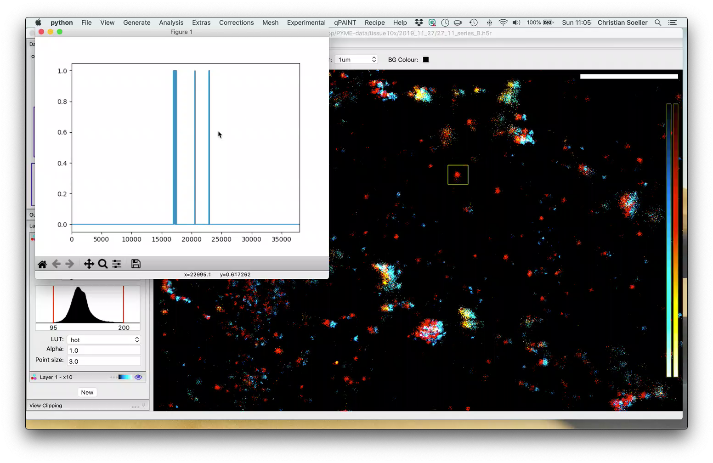

# A list of basic video tutorials for PYME functionality

*Note*: The videos are currently only accessible to users at the University of Exeter and require university login. In the future we may export videos that can be held in a public repository.

### PYME VisGUI x1 vs x10 - overlay and show gating

This video tutorials shows how to use layers and compare different data sources in a reasonable way. It also illustrates how to show the gating time course of a selected set of events.

Video Link: [PYME VisGUI x1 vs x10 - overlay and show gating](https://recapexeter.cloud.panopto.eu/Panopto/Pages/Viewer.aspx?id=d7ed5d1e-6311-4e5c-be95-ab9b00a775b7)

### PYME - FRC as a function of the number of frames

This video tutorials shows how to calculate the FRC (Fourier Ring Correlation) resolution of a sequence and vary the number of frames used for calculating the FRC resolution.

Video Link: [PYME - FRC as a function of the number of frames](https://recapexeter.cloud.panopto.eu/Panopto/Pages/Viewer.aspx?id=3a5581ab-e081-4a00-968d-ab9c015cc42b)

### PYME - Saving and loading visgui recipes

A basic overview how to save and load data processing pipelines in PYME.

Video Link: [PYME - Saving and loading visgui recipes](https://recapexeter.cloud.panopto.eu/Panopto/Pages/Viewer.aspx?id=9822295e-9e1a-48ce-a2a6-aba4008f6b34)

### PYME - finding and selecting fiducials

A basic overview how to find (locate) and then select fiducial information in PYME.

Video Link: [PYME - finding and selecting fiducials](https://recapexeter.cloud.panopto.eu/Panopto/Pages/Viewer.aspx?id=64c89833-784b-4556-88b4-aba400a12e91)

### PYME - applying fiducials for drift correction

A basic overview how to apply fiducial information to drift correct a data series in PYME.

Video Link: [PYME - applying fiducials for drift correction](https://recapexeter.cloud.panopto.eu/Panopto/Pages/Viewer.aspx?id=6c516348-95da-41da-b14f-aba400a848f7)

### PYME - Pipeline Whiteboard session

This is a slightly different video as it is purely a whiteboard session to briefly introduce the concept of the VisGUI pipeline. The VisGUI pipeline is the data processing pipeline that we apply to raw recorded events when we open an H5R file in VisGUI. It is suggested viewing before you go on to look at any of the more heavily recipe based videos above and below.

Video Link: [PYME - Pipeline Whiteboard session](https://recapexeter.cloud.panopto.eu/Panopto/Pages/Viewer.aspx?id=6c75ba0b-0ea8-45d6-b9ad-abb2008b30fe)

## ToDo List

- Recipes - changing recipe parameters to adjust analysis on the fly
- Filtering non-specific binding events in DNA-PAINT
- 3D visualisation with PYME