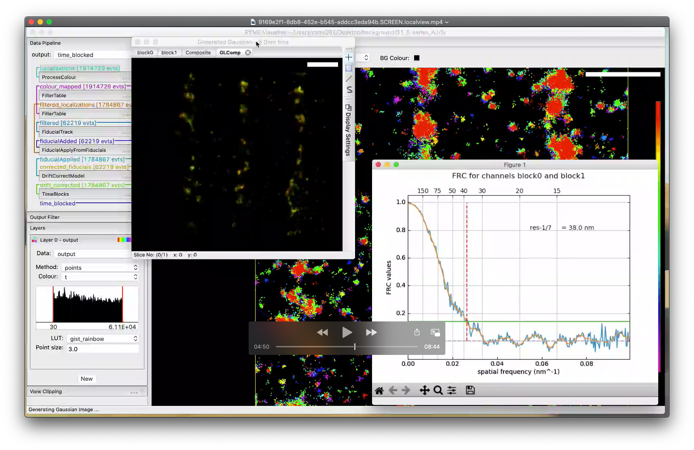

# A list of basic video tutorials for PYME functionality

*Note*: The videos are currently only accessible to users at the University of Exeter and require university login. In the future we may export videos that can be held in a public repository.

### PYME VisGUI x1 vs x10 - overlay and show gating

This video tutorials shows how to use layers and compare different data sources in a reasonable way. It also illustrates how to show the gating time course of a selected set of events.

Video Link: [PYME VisGUI x1 vs x10 - overlay and show gating](https://recapexeter.cloud.panopto.eu/Panopto/Pages/Viewer.aspx?id=d7ed5d1e-6311-4e5c-be95-ab9b00a775b7)

### PYME - FRC as a function of the number of frames

This video tutorials shows how to calculate the FRC (Fourier Ring Correlation) resolution of a sequence and vary the number of frames used for calculating the FRC resolution.

Video Link: [PYME - FRC as a function of the number of frames](https://recapexeter.cloud.panopto.eu/Panopto/Pages/Viewer.aspx?id=3a5581ab-e081-4a00-968d-ab9c015cc42b)

## ToDo List

- Recipes - saving and loading
- Recipes - changing recipe parameters to adjust analysis on the fly
- Fiducials - finding and applying fiducial information for drift correction
- Filtering non-specific binding events in DNA-PAINT
